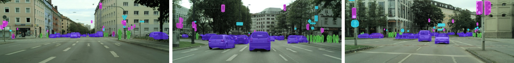

### ***The solution based on Poly-YOLO is runner-up in [Signate 3rd AI edge competition on object detection and tracking](https://signate.jp/competitions/256).***


This is reference implementation of our [ArXiv paper](https://arxiv.org/abs/2005.13243)


# What is inside?
The repository includes four folders with the following content:

* **poly_yolo:**
the reference implementation of Poly-YOLO

* **simulator_dataset:**
own synthetic dataset consisting of 700 training, 90 validation, and 100 test images with a resolution of 600x800px. The dataset is useful for fast prototyping, hyperparameter searching, or as a starting point for transfer learning because the low number of images allows fast training, and the captured scenes are trivial. It includes only a single class (a car), where its particular instances are rendered using a single 3D model. On the other hand, the scene is illuminated by physically-precise lights. 

* **synthetic_dataset:**
Script for generating an infinite number of images, where the following parameters can be configured: the resolution of images, the number of geometric primitives per image, the type of geometric primitives, and the range of their size. It is also possible to add a random background.

* **tpami_paper:**
Our messy scripts used for writing the paper


# [Poly-YOLO](https://www.youtube.com/watch?v=2KxNnEV-Zes)
[](https://www.youtube.com/watch?v=2KxNnEV-Zes)
We present a new version of YOLO extended with instance segmentation called Poly-YOLO. Poly-YOLO builds on the original ideas of YOLOv3 and removes two of its weaknesses: a large amount of rewritten labels and inefficient distribution of anchors. Poly-YOLO reduces the amount of rewritten labels by aggregating features from a light SE-Darknet-53 backbone with hypercolumn technique, using stairstep upsampling, and produces a single scale output with high resolution. In comparison with YOLOv3, Poly-YOLO has only 60\% of its trainable parameters but improves mAP by a relative 40\%. We also present Poly-YOLO lite with fewer parameters and a lower output resolution. It has the same precision as YOLOv3, but it is three times smaller and twice as fast, thus suitable for embedded devices. Finally, Poly-YOLO performs instance segmentation using bounding polygons. The network is trained to detect size-independent polygons defined on a polar grid. Vertices of each polygon are being predicted with their confidence and therefore Poly-YOLO produces polygons with a varying number of vertices.

**Poly-YOLO is based on the following repositories:**
* Qqwweee's Keras implementation of YOLOv3 https://github.com/qqwweee/keras-yolo3
* Titu1994's implementation of squeeze-and-excite blocks https://github.com/titu1994/keras-squeeze-excite-network
 
## Requirements
* Python 3.5.x
* Keras 2.3.0
* Tensorflow 1.15.0
* Numpy, PIL, OpenCV
* cudatoolkit 10.0
* cuDNN compatible with cudatoolkit 10.0
* numpy 1.16.4
 

## Issues and TODOs
* [x] Rewrite PIL data augmentation into OpenCV version
* [x] Turn off augmentation when validation data are processed during the training
* [ ] Add TF2.0 compatibility
* [x] Make script converting semantic segmentation labels into the Poly-YOLO format


## A Pipeline how to run it from scratch
1.  Take a dataset and set paths to it inside poly-yolo.py
2.  (Optional) with kmeans.py generate adjusted anchors
3.  (Optional) define classes in yolo_classes.py
3.  Run poly-yolo.py and train it. Optionally set optimizer, batch size, model resolution, nr of epochs etc.
4.  Run predictions for the best trained model

### Format of data for training
Generally, YOLO uses notation of one image per line. One line includes all the boxes inside an image. 
```
path_to\image1.jpg x1,y1,x2,y2,class,p1x,p1y,pnx,pny x1,y1,x2,y2,class,p1x,p1y,pnx,pny
path_to\image2.jpg x1,y1,x2,y2,class,p1x,p1y,pnx,pny
```
Where x1,y1 denote top-left of a bounding box and x2,y2 denote bottom-right. p1x,p1y ... pnx,pny are coordinates of bounding box vertices.
Script [labels_to_yolo_format.py](poly_yolo/conversion_scripts/labels_to_yolo_format.py) converts IDD and Cityscapes dataset annotations to yolo format. The generated annotation file is put to the provided image folder. Use '--help' for script parameters description.

### Example of inference
See https://gitlab.com/irafm-ai/poly-yolo/-/blob/master/poly_yolo/poly_yolo_inference.ipynb \
For an illustration of the performance and comparison between the versions, see our [YouYube video](https://www.youtube.com/watch?v=2KxNnEV-Zes).
